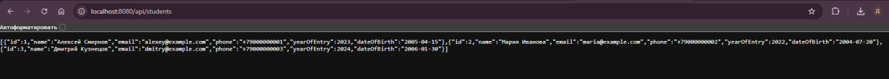

Это приложение Spring Boot, подключенное к базе данных PostgreSQL (`training_center`).

Оно предоставляет конечные точки REST API для управления курсами, преподавателями, студентами и регистрациями.
## Конечные точки API
- `GET /api/courses` - Список всех курсов
- `GET /api/teachers` - Список всех преподавателей
- `GET /api/students` - Список всех студентов
- `GET /api/registrations` - Список всех регистраций
  